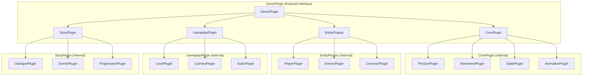

Perfect! That simplifies our migration plan significantly. Since UI is handled outside of demo, we can focus on the core gameplay mechanics, story systems, and entity management. Let me revise the migration plan to focus on what matters most.

## **Revised Migration Plan: Core Gameplay & Story (No UI)**

### **Updated Architecture Focus**


## **Simplified File Structure**

```
src/demo/
├── mod.rs                     # DemoPlugin (refactored)
├── core/                      # Core gameplay systems
│   ├── mod.rs                 # CorePlugin
│   ├── physics/
│   │   ├── mod.rs             # PhysicsPlugin
│   │   ├── body.rs            # PhysicsBody, collision, gravity
│   │   └── world.rs           # World interaction, wall detection
│   ├── movement/
│   │   ├── mod.rs             # MovementPlugin
│   │   ├── intent.rs          # MovementIntent, input processing
│   │   ├── capabilities.rs    # MovementCapabilities, abilities
│   │   └── controller.rs      # Movement logic, dash, wall jump
│   ├── state/
│   │   ├── mod.rs             # StatePlugin
│   │   ├── machine.rs         # StateMachine<T> component
│   │   └── transitions.rs     # State transition logic
│   └── animation/
│       ├── mod.rs             # AnimationPlugin
│       ├── sprite.rs          # AnimatedSprite component
│       └── controller.rs      # Animation state management
├── entities/                   # Game entities
│   ├── mod.rs                 # EntityPlugins
│   ├── player/
│   │   ├── mod.rs             # PlayerPlugin
│   │   ├── input.rs           # Player input handling
│   │   ├── states.rs          # Player state definitions
│   │   └── abilities.rs       # Dash, wall slide, wall jump
│   ├── enemy/
│   │   ├── mod.rs             # EnemyPlugin
│   │   ├── ai.rs              # Enemy AI behavior
│   │   ├── states.rs          # Enemy state machine
│   │   └── behaviors.rs       # Different enemy types
│   └── common/
│       ├── mod.rs             # CommonPlugin
│       ├── health.rs          # Health, damage, death
│       └── combat.rs          # Combat mechanics, hit detection
├── gameplay/                   # Game mechanics
│   ├── mod.rs                 # GameplayPlugin
│   ├── level.rs               # Level management, loading
│   ├── camera.rs              # Camera systems, follow logic
│   └── audio.rs               # Audio management, sound effects
├── story/                      # Narrative systems
│   ├── mod.rs                 # StoryPlugin
│   ├── dialogue.rs            # Dialogue system, text triggers
│   ├── events.rs              # Story events, cutscenes
│   └── progression.rs         # Story progression, save/load
├── helpers/                    # Keep existing helpers
│   ├── mod.rs
│   ├── anchor.rs
│   ├── camera.rs
│   └── tiled.rs
├── level.rs                    # Keep for now, will move to gameplay
├── player.rs                   # Keep for now, will move to entities/player
├── movement.rs                 # Keep for now, will move to core/movement
└── animation.rs                # Keep for now, will move to core/animation
```

## **Revised Migration Plan: Core Focus**

### **Phase 1: Foundation Setup (Week 1)**
**Goal**: Create new structure without breaking anything

#### **Step 1.1: Create Internal Directories (Safe)**
```bash
mkdir -p src/demo/core
mkdir -p src/demo/entities
mkdir -p src/demo/gameplay
mkdir -p src/demo/story
```

#### **Step 1.2: Create Empty Internal Plugins (Safe)**
```rust
// src/demo/core/mod.rs
use bevy::prelude::*;

pub struct CorePlugin;

impl Plugin for CorePlugin {
    fn build(&self, app: &mut App) {
        // Empty for now
    }
}

// src/demo/entities/mod.rs
use bevy::prelude::*;

pub struct EntityPlugins;

impl Plugin for EntityPlugins {
    fn build(&self, app: &mut App) {
        // Empty for now
    }
}

// src/demo/gameplay/mod.rs
use bevy::prelude::*;

pub struct GameplayPlugin;

impl Plugin for GameplayPlugin {
    fn build(&self, app: &mut App) {
        // Empty for now
    }
}

// src/demo/story/mod.rs
use bevy::prelude::*;

pub struct StoryPlugin;

impl Plugin for StoryPlugin {
    fn build(&self, app: &mut App) {
        // Empty for now
    }
}
```

#### **Step 1.3: Update Demo Plugin (Safe)**
```rust
// src/demo/mod.rs
use bevy::prelude::*;
use bevy_ecs_tilemap::prelude::*;

mod core;
mod entities;
mod gameplay;
mod story;
pub mod helpers;
pub mod level;

pub struct DemoPlugin;

impl Plugin for DemoPlugin {
    fn build(&self, app: &mut App) {
        // Add new internal plugins (empty for now)
        app.add_plugins((
            core::CorePlugin,
            entities::EntityPlugins,
            gameplay::GameplayPlugin,
            story::StoryPlugin,
        ));
        
        // Keep ALL existing systems working
        app.add_plugins((
            animation::plugin,
            level::plugin,
            movement::plugin,
            player::plugin,
        ));
        app.add_plugins(TilemapPlugin);
        app.add_plugins(helpers::tiled::TiledMapPlugin);
    }
}
```

### **Phase 2: Core Systems Migration (Week 2)**
**Goal**: Extract physics, movement, and animation without changing behavior

#### **Step 2.1: Physics System**
- Move physics logic from `MovementController` to `core/physics/`
- Create `PhysicsBody` component
- Implement gravity and collision detection
- **Test**: Same movement behavior

#### **Step 2.2: Movement System**
- Move movement logic to `core/movement/`
- Create `MovementIntent` and `MovementCapabilities`
- Separate input processing from physics
- **Test**: Same movement behavior

#### **Step 2.3: Animation System**
- Move animation logic to `core/animation/`
- Create generic `AnimatedSprite` component
- **Test**: Same visual behavior

### **Phase 3: Entity Systems (Week 3)**
**Goal**: Organize player and add enemies

#### **Step 3.1: Player Refactor**
- Move player logic to `entities/player/`
- Use new core systems
- **Test**: Same player behavior

#### **Step 3.2: Enemy System**
- Create enemy AI using same core systems
- Implement different enemy behaviors
- **Test**: Enemies work without breaking player

#### **Step 3.3: Common Systems**
- Health, damage, and combat mechanics
- **Test**: Combat works smoothly

### **Phase 4: Advanced Mechanics (Week 4)**
**Goal**: Implement dash, wall slide, wall jump

#### **Step 4.1: Wall Detection**
- Enhanced physics with wall detection
- Wall sliding mechanics
- **Test**: Wall interactions feel responsive

#### **Step 4.2: Advanced Movement**
- Dash ability with cooldown
- Wall jump mechanics
- **Test**: New abilities feel like Celeste

### **Phase 5: Gameplay & Story (Week 5)**
**Goal**: Level management and narrative elements

#### **Step 5.1: Gameplay Systems**
- Level loading and management
- Camera systems
- Audio integration
- **Test**: Smooth level transitions

#### **Step 5.2: Story Systems**
- Dialogue triggers
- Story progression
- Event systems
- **Test**: Story elements integrate smoothly

### **Phase 6: Cleanup & Polish (Week 6)**
**Goal**: Remove old code and optimize

#### **Step 6.1: Remove Old Systems**
- Delete old `player.rs`, `movement.rs`, `animation.rs`
- Clean up unused imports
- **Test**: Game still runs perfectly

#### **Step 6.2: Performance & Polish**
- Optimize system ordering
- Performance testing
- Bug fixes and polish

## **Key Benefits of This Focused Approach**

1. **No UI Complexity**: Focus on core gameplay mechanics
2. **Faster Migration**: Fewer systems to refactor
3. **Clear Priorities**: Core gameplay first, story second
4. **Easier Testing**: Pure gameplay systems are easier to validate
5. **Better Performance**: Optimized core systems without UI overhead

## **Testing Strategy**

### **Core Systems Testing**
- Movement feels identical to current system
- Physics behavior unchanged
- Animation timing preserved
- Performance maintained or improved

### **New Features Testing**
- Dash feels responsive and fun
- Wall slide mechanics work smoothly
- Wall jump physics feel right
- Enemies behave predictably

### **Integration Testing**
- Story elements don't interfere with gameplay
- Level transitions are smooth
- Audio doesn't cause stuttering
- Multiple entities don't impact performance

This focused approach should give us a much cleaner, more maintainable demo plugin while keeping the migration manageable and testable. Would you like me to start implementing Phase 1 with the foundation setup?
