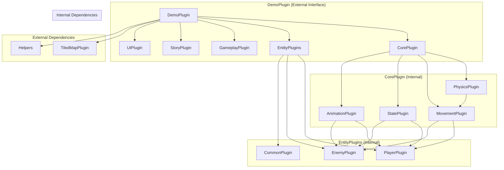

Perfect! You want that same clean plugin architecture, but organized **within** your demo plugin. Let me create a revised diagram and implementation plan that shows how to achieve this structure inside your demo plugin.

## **Demo Plugin Internal Architecture**



## **Implementation Plan: Demo Plugin Internal Refactor**

### **Step 1: Create Internal Directory Structure**
```bash
# Create new internal structure within demo
mkdir -p src/demo/core
mkdir -p src/demo/entities
mkdir -p src/demo/gameplay
mkdir -p src/demo/story
mkdir -p src/demo/ui
```

### **Step 2: Refactor Demo Plugin Module**
```rust
// src/demo/mod.rs - Main DemoPlugin (external interface unchanged)
use bevy::prelude::*;
use bevy_ecs_tilemap::prelude::*;

mod core;
mod entities;
mod gameplay;
mod story;
mod ui;
pub mod helpers;  // Keep existing helpers public
pub mod level;    // Keep existing level public for now

pub struct DemoPlugin;

impl Plugin for DemoPlugin {
    fn build(&self, app: &mut App) {
        // Internal plugin organization
        app.add_plugins((
            core::CorePlugin,
            entities::EntityPlugins,
            gameplay::GameplayPlugin,
            story::StoryPlugin,
            ui::UIPlugin,
        ));
        
        // Keep existing external dependencies
        app.add_plugins(TilemapPlugin);
        app.add_plugins(helpers::tiled::TiledMapPlugin);
    }
}
```

### **Step 3: Create Internal Core Plugin**
```rust
// src/demo/core/mod.rs
use bevy::prelude::*;

pub mod physics;
pub mod movement;
pub mod state;
pub mod animation;

pub struct CorePlugin;

impl Plugin for CorePlugin {
    fn build(&self, app: &mut App) {
        app.add_plugins((
            physics::PhysicsPlugin,
            movement::MovementPlugin,
            state::StatePlugin,
            animation::AnimationPlugin,
        ));
    }
}
```

### **Step 4: Create Internal Entity Plugins**
```rust
// src/demo/entities/mod.rs
use bevy::prelude::*;

pub mod player;
pub mod enemy;
pub mod common;

pub struct EntityPlugins;

impl Plugin for EntityPlugins {
    fn build(&self, app: &mut App) {
        app.add_plugins((
            player::PlayerPlugin,
            enemy::EnemyPlugin,
            common::CommonPlugin,
        ));
    }
}
```

### **Step 5: Create Internal Gameplay Plugin**
```rust
// src/demo/gameplay/mod.rs
use bevy::prelude::*;

pub mod level;
pub mod camera;
pub mod audio;

pub struct GameplayPlugin;

impl Plugin for GameplayPlugin {
    fn build(&self, app: &mut App) {
        app.add_plugins((
            level::LevelPlugin,
            camera::CameraPlugin,
            audio::AudioPlugin,
        ));
    }
}
```

## **File Structure After Refactor**

```
src/
├── main.rs
├── demo/                           # ← Your exportable plugin
│   ├── mod.rs                     # DemoPlugin (refactored)
│   ├── core/                      # Internal core systems
│   │   ├── mod.rs                 # CorePlugin
│   │   ├── physics/
│   │   │   ├── mod.rs             # PhysicsPlugin
│   │   │   ├── body.rs            # PhysicsBody component
│   │   │   ├── collision.rs       # Collision systems
│   │   │   └── gravity.rs         # Gravity systems
│   │   ├── movement/
│   │   │   ├── mod.rs             # MovementPlugin
│   │   │   ├── intent.rs          # MovementIntent component
│   │   │   ├── capabilities.rs    # MovementCapabilities component
│   │   │   └── controller.rs      # Movement systems
│   │   ├── state/
│   │   │   ├── mod.rs             # StatePlugin
│   │   │   ├── machine.rs         # StateMachine component
│   │   │   └── transitions.rs     # State transition systems
│   │   └── animation/
│   │       ├── mod.rs             # AnimationPlugin
│   │       ├── sprite.rs          # AnimatedSprite component
│   │       └── controller.rs      # Animation systems
│   ├── entities/                  # Internal entity systems
│   │   ├── mod.rs                 # EntityPlugins
│   │   ├── player/
│   │   │   ├── mod.rs             # PlayerPlugin
│   │   │   ├── input.rs           # Input handling systems
│   │   │   ├── states.rs          # Player state definitions
│   │   │   └── abilities.rs       # Player ability systems
│   │   ├── enemy/
│   │   │   ├── mod.rs             # EnemyPlugin
│   │   │   ├── ai.rs              # AI behavior systems
│   │   │   └── states.rs          # Enemy state definitions
│   │   └── common/
│   │       ├── mod.rs             # CommonPlugin
│   │       ├── health.rs          # Health systems
│   │       └── combat.rs          # Combat systems
│   ├── gameplay/                  # Internal gameplay systems
│   │   ├── mod.rs                 # GameplayPlugin
│   │   ├── level.rs               # Level management (moved from root)
│   │   ├── camera.rs              # Camera systems
│   │   └── audio.rs               # Audio management
│   ├── story/                     # Internal story systems
│   │   ├── mod.rs                 # StoryPlugin
│   │   ├── dialogue.rs            # Dialogue systems
│   │   └── events.rs              # Story event systems
│   ├── ui/                        # Internal UI systems
│   │   ├── mod.rs                 # UIPlugin
│   │   ├── hud.rs                 # HUD systems
│   │   └── menus.rs               # Menu systems
│   ├── helpers/                   # Keep existing helpers
│   │   ├── mod.rs
│   │   ├── anchor.rs
│   │   ├── camera.rs
│   │   └── tiled.rs
│   └── level.rs                   # Keep for now, will move to gameplay
├── menus/                         # Other plugins unchanged
├── screens/                       # Other plugins unchanged
└── theme/                         # Other plugins unchanged
```

## **Migration Steps**

### **Phase 1: Create Internal Structure (Week 1)**
1. Create new directories within `src/demo/`
2. Create `core/mod.rs` with `CorePlugin`
3. Create `entities/mod.rs` with `EntityPlugins`
4. Create `gameplay/mod.rs` with `GameplayPlugin`
5. Update `demo/mod.rs` to use new internal structure

### **Phase 2: Move Existing Systems (Week 2)**
1. Move physics logic from `movement.rs` to `core/physics/`
2. Move movement logic to `core/movement/`
3. Move animation logic to `core/animation/`
4. Move player logic to `entities/player/`
5. Move level logic to `gameplay/level/`

### **Phase 3: Add New Features (Week 3-4)**
1. Add enemy systems in `entities/enemy/`
2. Add story systems in `story/`
3. Add UI systems in `ui/`
4. Implement dash, wall slide, wall jump

## **Key Benefits**

1. **Clean Internal Architecture**: Same structure you wanted, but inside demo
2. **External Interface Unchanged**: Other code using your plugin won't break
3. **Modular Design**: Easy to maintain and extend
4. **Plugin Export**: Demo remains a single, cohesive plugin
5. **Gradual Migration**: Can refactor piece by piece

Would you like me to start implementing this? I can begin by creating the new directory structure and the internal plugin files while keeping your existing demo code working.
